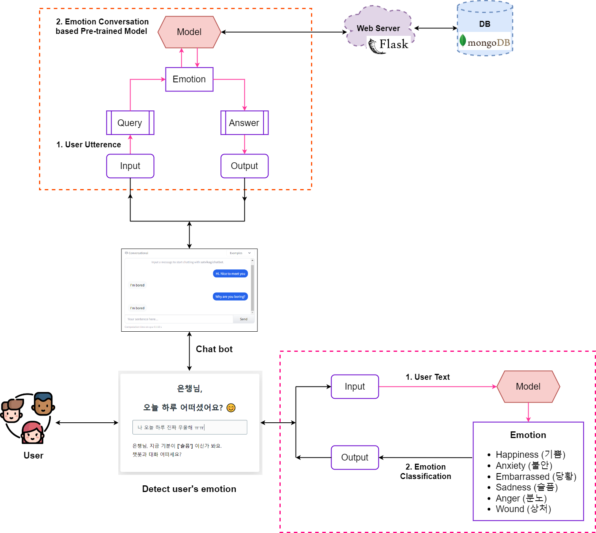

---

---

~~연구 진행 방향 수정됨~~

- ~~기존 공개데이터셋의 구성 방안을 분석하여 텍스트 데이터 활용 감정 분류 모델을 보다 구체적이고 세부적으로 설계하는 것이 필요함~~

~~[기업에서 제안한 프로젝트 방향]~~

1. ~~데이터 수집 방법 설계~~
2. ~~데이터 수집 도구 개발~~
3. ~~데이터 분석을 통한 감정 분류 모델 학습 방법 구현~~

---------------------------

- 딥러닝 챗봇 모델 만들기
- ~~Bootstrap으로 챗봇 화면 구성~~
- (프론트엔드) html,css,javascript
- (백엔드) Flask로 웹 서버 구현

----------

파일 실행 관련

env : ``py-study``

``python main.py``

- 현재 구현 완료
  - 로그인, 로그아웃
  - 계정 생성 (정보입력: 이메일, 비밀번호, 연령대, 성별)
  - 챗봇 인터페이스
- To do
  - 서버에 모델 올리기 + weights load
  - 챗봇과 대화할 수 있도록 모델이랑 연결해서 기능 구현

-------------------

[System Configuration]

